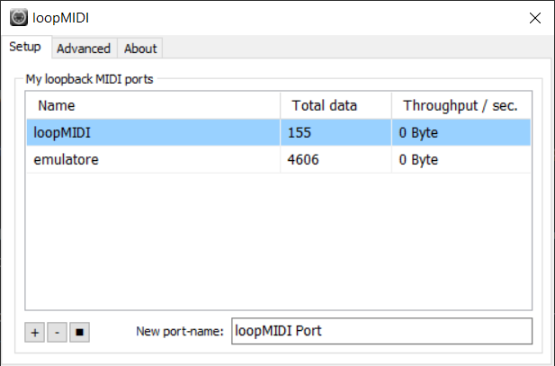

# AutoPlay for LivePrompter


## Installation

### Install loopMIDI

* <a href="https://www.tobias-erichsen.de/software/loopmidi.html">Download</a> and install loopMIDI.
This creates an internal loop of MIDI channels.

<p align="center"></p>

### Install LivePrompter

* <a href="https://www.liveprompter.com/download/">Download</a> and install LivePrompter.

### Update the LivePrompter.ini

```
; MIDI in
MidiInPC=yes
MidiInKeys=yes
MidiInPort=loopMIDI
MidiInChannel=omni
MidiInKeyPausePlay=CC 7
```

## Usage
### Create a loopMIDI port
Open the loopMIDI app. Create a loop MIDI channel named "loopMIDI" by clicking the + button.

### Connect your MIDI hardware port.
To check the hardware MIDI input name, run the "AutoPlayer.exe" with double click (it's inside the "dist" folder in this repository).
In the AutoPlayer's terminal window you should see the following:
```
AutoPlayer for LivePrompter by PaoloRos. v2
OUT > Opening output midi port: loopMIDI 1... OK - Output is connected!
IN > Opening attempt for input: emulatore 1... FAILED. New attempt in 10 seconds >>>
INPUT(s) available:      ['loopMIDI 0', 'HW_MIDI_port1 1', 'HW_MIDI_port2 2']
```
Copy the hardware MIDI input name port (displayed in the list after "INPUT(s) available") with the space and the ending number included, i.e. the whole chars between the apostrophes.
Paste the just copied name inside the "autoplayer.ini" file (always located in the "dist" folder of this repository) after "midi_in = ".

### Open the LivePrompter software.
Open the Live pormpter software. Normally the song list is empty, you need to add some lyrics by yourself.

### Run the AutoPlayer
Run the "AutoPlayer.exe" with double click.
To check if you did it right, on the AutoPlayer's terminal windows it should appear:

```
AutoPlayer for LivePrompter by PaoloRos. v2
OUT > Opening output midi port: loopMIDI 1... OK - Output is connected!
IN > Opening attempt for input: emulatore 1... OK - Input is connected!

- MIDI input:    emulatore 1 (Channel 0)
- MIDI output:   loopMIDI 1 (Channel 0)
- Lyrics change MIDI command:   program_change (Channel 0)
- Play trigger MIDI command:    control_change (Channel 0)

>>> Waiting for MIDI message...
```

## How it works

There is a main device that sends midi commands (in my case it's a Cymatic Audio LP 16 - with MIDI output).
When the Cymatic's physical Play button is triggered, it sends a MIDI program_change (each song is mapped with its specific number, from 0 to 127).

The Cymatic's MIDI output is wired with the MIDI-usb device's input, connected to the Windows PC target.

This MIDI program_change message is received by the AutoPlayer software (the one you find in this repsitory) that forwards the program_change message to the LivePrompter (via the loopMIDI port) and append also the Play/Start MIDI message (in this case a control_change, CC 7) to LivePrompter that starts the lyric scrolling.

With this "add-on", LivePrompter loads and starts the lyrics automatically, instead of just loading it (i.e. without starting the scrolling by itself).

## Working chain
Cymatic >> MIDI cable >> MIDI-usb device >> AutoPlayer >> loopMIDI >> LivePrompter.

- AutoPlayer is the software I made and it's available for free in this repository.
- loopMIDI is a third-party software.

